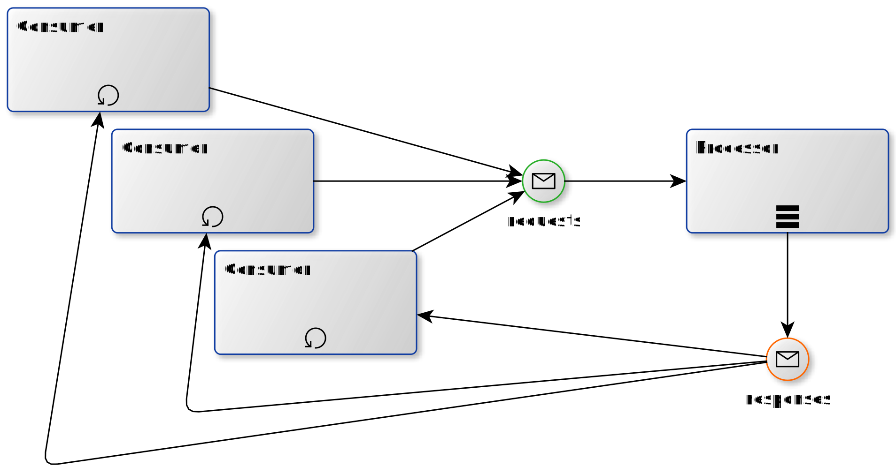

class: center, middle

# Active objects
### How to remove mutexes from your codebase


March 25, 2019, Alexander Stavonin, alex@sysdev.me
---
# Problem description

- Go gives us very chip concurrency;
- Some applications has _state_;
- Chip concurrency + states often leads us to...

--

```go
type SomeStruct struct {
	
    someMap map[int]string
    someMapLock sync.RWMutex
    
    someArray []string
    someArrayLock sync.RWMutex
}
```

--
- But is it possible to have something like...?

```go
type SomeStruct struct {
	
    someMap map[int]string
    someArray []string
}
```
---

# Motivation (1/2)

### Races and deadlocks:

- Developer should carefully choose big enough code block protected by lock;

    - How big protected area should be? Whole function? `if` block?

--

- Developer should choose right lock type (`RLock` or `Lock`);

    - should I call `someMapLock.Lock()` or `someMapLock.RLock()` and why?

--

- Developer must not forget to unlock mutex.

    - `defer` helps a lot, but it works only in function scope, but not `if` or `for` scopes.

---
# Motivation (2/2)

### Amdahl's law

$$S_\text{latency}(s) = \frac 1 {(1 - p) + \frac p s}$$

where:

- S<sub>latency</sub> is the theoretical speedup of the execution of the whole task;
- `s` is the speedup of the part of the task that benefits from improved system resources (parallel execution count);
- `p` is the proportion of execution time that the part benefiting from improved resources originally occupied (in %).

Impact: if you can run in  parallel 25% of your code on 10 executors (threads) then **theoretically** achievable speedup is 3.077 and only 3.883 for 100 executors!

---
# Concurrent interactions

There are 2 main types of interaction in concurrent applications:

- Shared memory;

- Message passing:
    
    - Communicating sequential processes (CSP);
    
    - Actors model.

---
# Concurrent interactions
### Shared memory

- Most common way for cross process/thread interaction in concurrent world;

- Supported by almost all languages (at least for cross thread communication);

- Fastest way across all other techniques;

- Error prone: deadlocks and races are very common for shared memory access.

---
# Concurrent interactions
### Communicating sequential processes (CSP)

- CSP was first described in a 1978 paper by Tony Hoare and significantly improved in 1985;

- Go is one of multiple languages which support CSP.
    - CSP is also implemented in Rust, Clojure, OCaml, etc.
    
- `Channel`s as a cross process/thread communication way is core component of CSP.

- All modern CSP implementations much more secure then Shared memory.

- Deadlocks are still possible as any Goroutine may have multiple Channels.

---
# Concurrent interactions
### Actors

- Very similar to CSP, but...

    - CSP processes are anonymous, while actors have identities.
    
    - CSP uses explicit channels for message passing, whereas actor systems transmit messages to named destination actors.

    - *Invalid for Go CSP implementation statement*: CSP message-passing fundamentally involves a rendezvous between the processes involved in sending and receiving the message, i.e. the sender cannot transmit a message until the receiver is ready to accept it.

- Some languages has Actors model implementation out of the box like Erlang.

- Or has very famous implementation like AKKA from Scala.

---
# What is Active Object?

The idea of Active Object is based on Actors model and was initially described in Pattern-Oriented Software Architecture (POSA book, 1996).



---
#Communication interface

Each request should have unique type. Same idea as function call.

```go
type requestCommand int

const(
	genNum requestCommand = iota
	runCmd
)
```

--
Request is not only command type, but also command data (if any) and a way to push response back.
```go
type request struct {
	cmd requestCommand
	data interface {}
	out chan response
}
```

--
Processor is able to generate any type of response. In luck of metaprogramming, `interface {}` is a good option.
```go
type response interface {}
```

---
# Processing a request 1/3
### Main processor

```go
func processRequest(req request)  {
	switch req.cmd {
	case genNum:
		req.out <- rand.Intn(100)
	case runCmd:
		go doExec(req)
	}
}
```
where:
    - `req.cmd` is command type
    - `req.out` is outcoming channel (a way to tell caller result)
- fast command `genNum` should be executed "in place"
- we need special handling for slow command `runCmd`

---
# Processing a request 2/3
### Slow commands

```go
func doExec(req request) {
	time.Sleep(1*time.Second)

	cmd := req.data.(string)
	out, err := exec.Command(cmd).Output()
	if err != nil {
		req.out <- err.Error()
	} else {
		req.out <- string(out)
	}
}
```
where:
    - `Sleep` just for illustration proposes of delay.
    - `exec.Command` is external command execution.
    - `req.out` is outcoming channel (same as earlier).

---
# Processing a request 3/3
## Event loop

```go
func eventLoop(done chan struct{}, inCh chan request) {
	for {
		select {
		case req := <-inCh:
			processRequest(req)
		case <-done:
			break
		}
	}
}
```
where:
    - `inCh` is an input channel. Input channel is the only way to interact with Processor.
    - `done` signal for shutting processor down.

---
```go
	done := make(chan struct{})
	inCh := make(chan request, 10)

	go eventLoop(done, inCh)
```
```go
	resp := make(chan response, 1)

	inCh <- request{
		runCmd,
		"ls",
		resp,
	}
	fmt.Println(<-resp1)
```
---
# Questions and comments are welcome! :)